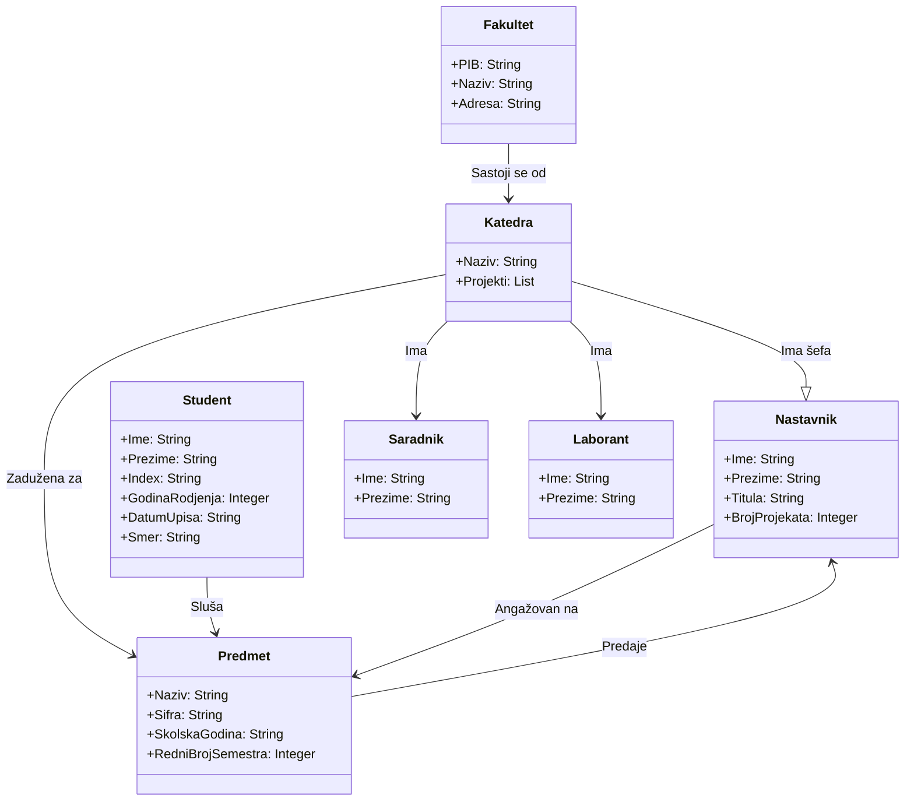

```mermaid
classDiagram
    class Fakultet {
        +PIB: String
        +Naziv: String
        +Adresa: String
    }
    
    class Katedra {
        +Naziv: String
        +Projekti: List<String>
    }
    
    class Predmet {
        +Naziv: String
        +Sifra: String
        +SkolskaGodina: String
        +RedniBrojSemestra: Integer
    }
    
    class Student {
        +Ime: String
        +Prezime: String
        +Index: String
        +GodinaRodjenja: Integer
        +DatumUpisa: String
        +Smer: String
    }
    
    class Nastavnik {
        +Ime: String
        +Prezime: String
        +Titula: String
        +BrojProjekata: Integer
    }
    
    class Saradnik {
        +Ime: String
        +Prezime: String
    }
    
    class Laborant {
        +Ime: String
        +Prezime: String
    }
    
    Fakultet --> Katedra : Sastoji se od
    Katedra --|> Nastavnik : Ima šefa
    Katedra --> Saradnik : Ima
    Katedra --> Laborant : Ima
    Katedra --> Predmet : Zadužena za
    Predmet --> Nastavnik : Predaje
    Student --> Predmet : Sluša
    Nastavnik --> Predmet : Angažovan na
```
