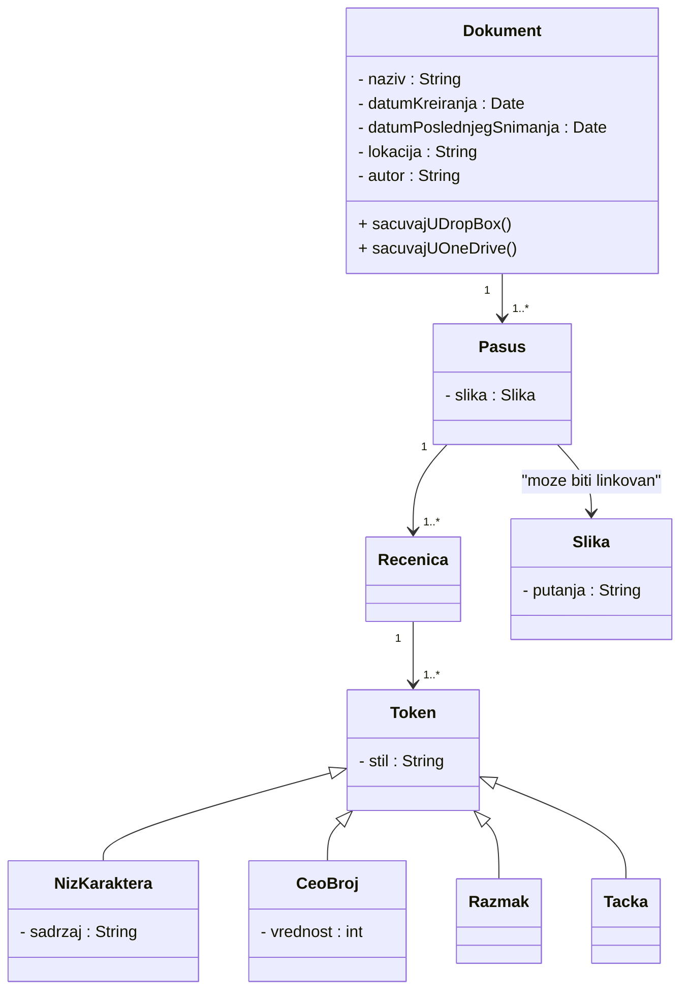

```mermaid
classDiagram
    class Dokument {
        - naziv : String
        - datumKreiranja : Date
        - datumPoslednjegSnimanja : Date
        - lokacija : String
        - autor : String
        + sacuvajUDropBox()
        + sacuvajUOneDrive()
    }

    class Pasus {
        - slika : Slika
    }

    class Recenica {
    }

    class Token {
        - stil : String
    }

    class NizKaraktera {
        - sadrzaj : String
    }

    class CeoBroj {
        - vrednost : int
    }

    class Razmak {
    }

    class Tacka {
    }

    class Slika {
        - putanja : String
    }

    Dokument "1" --> "1..*" Pasus
    Pasus "1" --> "1..*" Recenica
    Recenica "1" --> "1..*" Token
    Pasus --> Slika : "moze biti linkovan"
    Token <|-- NizKaraktera
    Token <|-- CeoBroj
    Token <|-- Razmak
    Token <|-- Tacka


```
