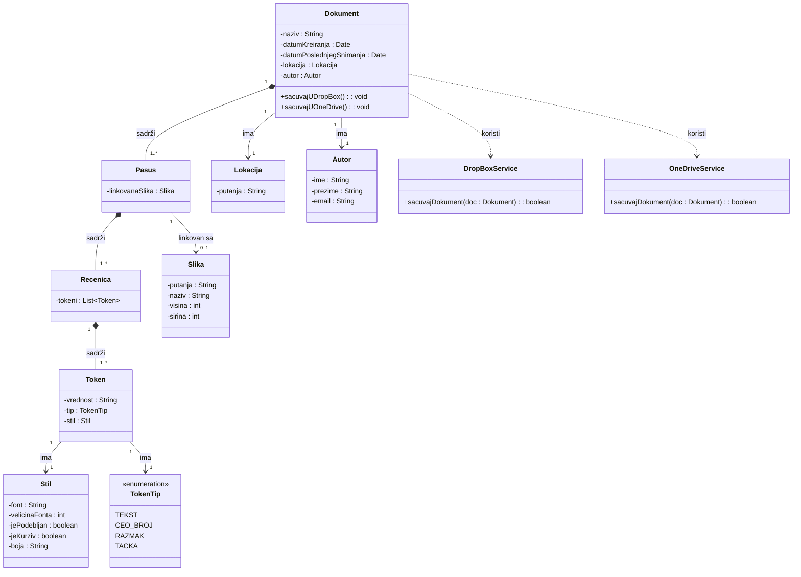

```mermaid
classDiagram
    class Dokument {
        -naziv : String
        -datumKreiranja : Date
        -datumPoslednjegSnimanja : Date
        -lokacija : Lokacija
        -autor : Autor
        +sacuvajUDropBox() : void
        +sacuvajUOneDrive() : void
    }

    class Pasus {
        -linkovanaSlika : Slika
    }

    class Recenica {
        -tokeni : List~Token~
    }

    class Token {
        -vrednost : String
        -tip : TokenTip
        -stil : Stil
    }

    class Stil {
        -font : String
        -velicinaFonta : int
        -jePodebljan : boolean
        -jeKurziv : boolean
        -boja : String
    }

    class TokenTip {
        <<enumeration>>
        TEKST
        CEO_BROJ
        RAZMAK
        TACKA
    }

    class Slika {
        -putanja : String
        -naziv : String
        -visina : int
        -sirina : int
    }

    class Lokacija {
        -putanja : String
    }

    class Autor {
        -ime : String
        -prezime : String
        -email : String
    }

    class DropBoxService {
        +sacuvajDokument(doc : Dokument) : boolean
    }

    class OneDriveService {
        +sacuvajDokument(doc : Dokument) : boolean
    }

    %% KOMPOZICIJA - jaki odnosi
    Dokument "1" *-- "1..*" Pasus : sadrži
    Pasus "1" *-- "1..*" Recenica : sadrži
    Recenica "1" *-- "1..*" Token : sadrži

    %% ASOCIJACIJE - obični odnosi
    Token "1" --> "1" Stil : ima
    Token "1" --> "1" TokenTip : ima
    Pasus "1" --> "0..1" Slika : linkovan sa
    Dokument "1" --> "1" Lokacija : ima
    Dokument "1" --> "1" Autor : ima

    %% ZAVISNOSTI - koristi servise
    Dokument ..> DropBoxService : koristi
    Dokument ..> OneDriveService : koristi
```
