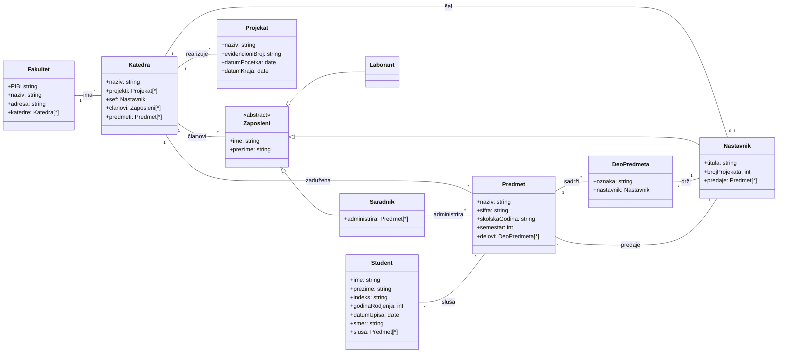

```mermaid
classDiagram
    direction LR

    class Fakultet {
        +PIB: string
        +naziv: string
        +adresa: string
        +katedre: Katedra[*]
    }

    class Katedra {
        +naziv: string
        +projekti: Projekat[*]
        +sef: Nastavnik
        +clanovi: Zaposleni[*]
        +predmeti: Predmet[*]
    }

    class Zaposleni {
        <<abstract>>
        +ime: string
        +prezime: string
    }

    class Saradnik {
        +administrira: Predmet[*]
    }

    class Nastavnik {
        +titula: string
        +brojProjekata: int
        +predaje: Predmet[*]
    }

    class Laborant {
    }

    class Predmet {
        +naziv: string
        +sifra: string
        +skolskaGodina: string
        +semestar: int
        +delovi: DeoPredmeta[*]
    }

    class DeoPredmeta {
        +oznaka: string
        +nastavnik: Nastavnik
    }

    class Projekat {
        +naziv: string
        +evidencioniBroj: string
        +datumPocetka: date
        +datumKraja: date
    }

    class Student {
        +ime: string
        +prezime: string
        +indeks: string
        +godinaRodjenja: int
        +datumUpisa: date
        +smer: string
        +slusa: Predmet[*]
    }

    Fakultet "1" -- "*" Katedra : ima
    Katedra "1" -- "*" Zaposleni : članovi
    Katedra "1" -- "*" Predmet : zadužena
    Katedra "1" -- "0..1" Nastavnik : šef
    Zaposleni <|-- Saradnik
    Zaposleni <|-- Nastavnik
    Zaposleni <|-- Laborant
    Nastavnik "1" -- "*" Predmet : predaje
    Predmet "1" -- "*" DeoPredmeta : sadrži
    DeoPredmeta "*" -- "1" Nastavnik : drži
    Saradnik "1" -- "*" Predmet : administrira
    Student "*" -- "*" Predmet : sluša
    Katedra "1" -- "*" Projekat : realizuje
```
