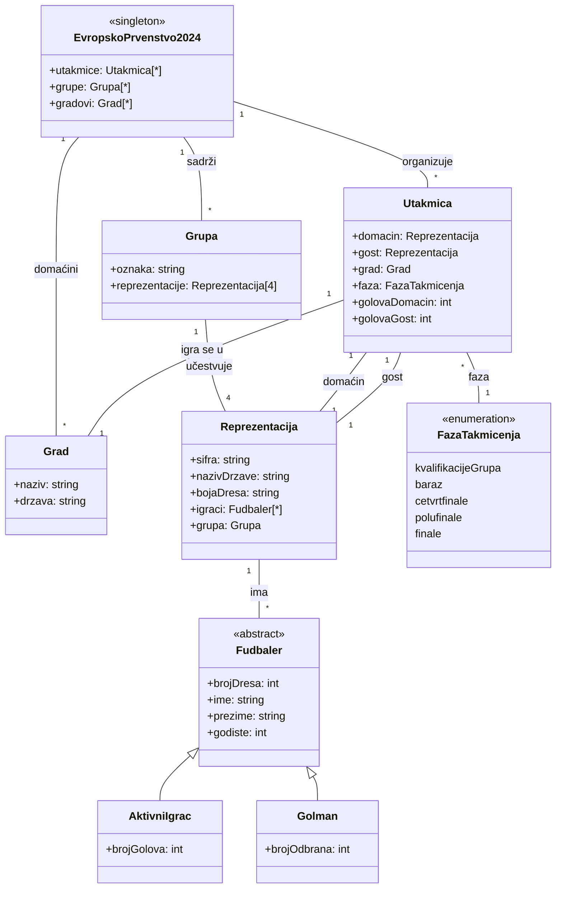

```mermaid
classDiagram
    direction TB

    class EvropskoPrvenstvo2024 {
        <<singleton>>
        +utakmice: Utakmica[*]
        +grupe: Grupa[*]
        +gradovi: Grad[*]
    }

    class Grad {
        +naziv: string
        +drzava: string
    }

    class Reprezentacija {
        +sifra: string
        +nazivDrzave: string
        +bojaDresa: string
        +igraci: Fudbaler[*]
        +grupa: Grupa
    }

    class Fudbaler {
        <<abstract>>
        +brojDresa: int
        +ime: string
        +prezime: string
        +godiste: int
    }

    class AktivniIgrac {
        +brojGolova: int
    }

    class Golman {
        +brojOdbrana: int
    }

    class Grupa {
        +oznaka: string
        +reprezentacije: Reprezentacija[4]
    }

    class Utakmica {
        +domacin: Reprezentacija
        +gost: Reprezentacija
        +grad: Grad
        +faza: FazaTakmicenja
        +golovaDomacin: int
        +golovaGost: int
    }

    class FazaTakmicenja {
        <<enumeration>>
        kvalifikacijeGrupa
        baraz
        cetvrtfinale
        polufinale
        finale
    }

    %% =========  RELATIONS  =========
    EvropskoPrvenstvo2024 "1" -- "*" Grupa : sadrži
    EvropskoPrvenstvo2024 "1" -- "*" Utakmica : organizuje
    EvropskoPrvenstvo2024 "1" -- "*" Grad : domaćini

    Grupa "1" -- "4" Reprezentacija : učestvuje

    Reprezentacija "1" -- "*" Fudbaler : ima

    Fudbaler <|-- AktivniIgrac
    Fudbaler <|-- Golman

    Utakmica "1" -- "1" Reprezentacija : domaćin
    Utakmica "1" -- "1" Reprezentacija : gost
    Utakmica "1" -- "1" Grad : igra se u
    Utakmica "*" -- "1" FazaTakmicenja : faza
```
