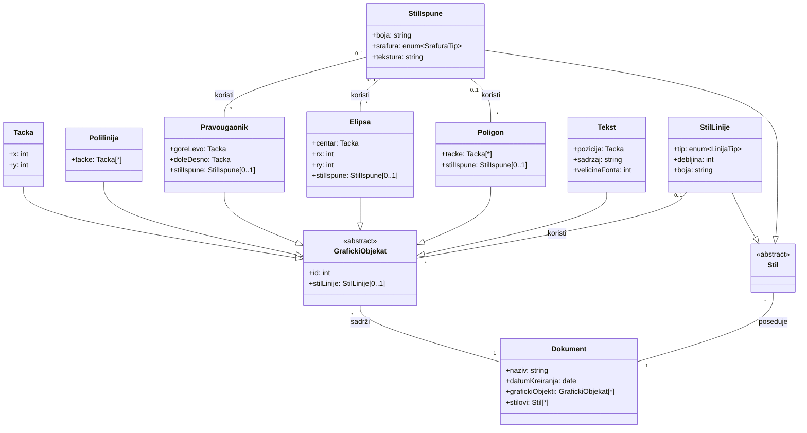

```mermaid
classDiagram
    direction BT

    %% =========  CORE CLASSES  =========
    class Dokument {
        +naziv: string
        +datumKreiranja: date
        +grafickiObjekti: GrafickiObjekat[*]
        +stilovi: Stil[*]
    }

    class GrafickiObjekat {
        <<abstract>>
        +id: int
        +stilLinije: StilLinije[0..1]
    }

    class Tacka {
        +x: int
        +y: int
    }

    class Polilinija {
        +tacke: Tacka[*]
    }

    class Pravougaonik {
        +goreLevo: Tacka
        +doleDesno: Tacka
        +stilIspune: StilIspune[0..1]
    }

    class Elipsa {
        +centar: Tacka
        +rx: int
        +ry: int
        +stilIspune: StilIspune[0..1]
    }

    class Poligon {
        +tacke: Tacka[*]
        +stilIspune: StilIspune[0..1]
    }

    class Tekst {
        +pozicija: Tacka
        +sadrzaj: string
        +velicinaFonta: int
    }

    %% =========  STYLE HIERARCHY  =========
    class Stil {
        <<abstract>>
    }

    class StilLinije {
        +tip: enum~LinijaTip~
        +debljina: int
        +boja: string
    }

    class StilIspune {
        +boja: string
        +srafura: enum~SrafuraTip~
        +tekstura: string
    }

    %% =========  RELATIONS  =========
    Dokument "1" -- "*" GrafickiObjekat : sadrži
    Dokument "1" -- "*" Stil : poseduje

    GrafickiObjekat <|-- Tacka
    GrafickiObjekat <|-- Polilinija
    GrafickiObjekat <|-- Pravougaonik
    GrafickiObjekat <|-- Elipsa
    GrafickiObjekat <|-- Poligon
    GrafickiObjekat <|-- Tekst

    Stil <|-- StilLinije
    Stil <|-- StilIspune

    GrafickiObjekat "*" -- "0..1" StilLinije : koristi
    Pravougaonik "*" -- "0..1" StilIspune : koristi
    Elipsa "*" -- "0..1" StilIspune : koristi
    Poligon "*" -- "0..1" StilIspune : koristi
```
