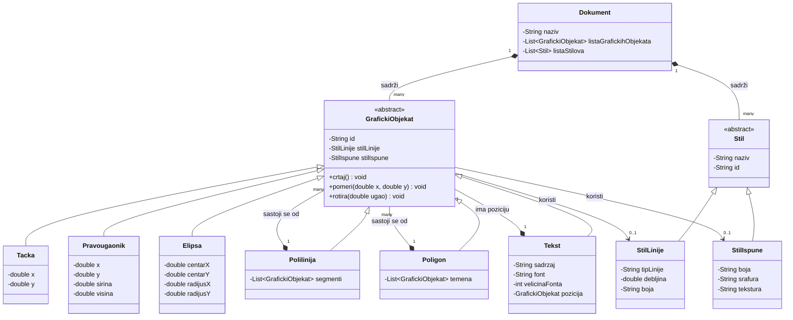

```mermaid
classDiagram
    class Dokument {
        -String naziv
        -List~GrafickiObjekat~ listaGrafickihObjekata
        -List~Stil~ listaStilova
    }

    class GrafickiObjekat {
        <<abstract>>
        -String id
        -StilLinije stilLinije
        -StilIspune stilIspune
        +crtaj() void
        +pomeri(double x, double y) void
        +rotira(double ugao) void
    }

    class Stil {
        <<abstract>>
        -String naziv
        -String id
    }

    class StilLinije {
        -String tipLinije
        -double debljina
        -String boja
    }

    class StilIspune {
        -String boja
        -String srafura
        -String tekstura
    }

    class Tacka {
        -double x
        -double y
    }

    class Polilinija {
        -List~GrafickiObjekat~ segmenti
    }

    class Pravougaonik {
        -double x
        -double y
        -double sirina
        -double visina
    }

    class Elipsa {
        -double centarX
        -double centarY
        -double radijusX
        -double radijusY
    }

    class Poligon {
        -List~GrafickiObjekat~ temena
    }

    class Tekst {
        -String sadrzaj
        -String font
        -int velicinaFonta
        -GrafickiObjekat pozicija
    }

    Dokument "1" *-- "many" GrafickiObjekat : sadrži
    Dokument "1" *-- "many" Stil : sadrži
    
    GrafickiObjekat <|-- Tacka
    GrafickiObjekat <|-- Polilinija
    GrafickiObjekat <|-- Pravougaonik
    GrafickiObjekat <|-- Elipsa
    GrafickiObjekat <|-- Poligon
    GrafickiObjekat <|-- Tekst
    
    Stil <|-- StilLinije
    Stil <|-- StilIspune
    
    GrafickiObjekat --> "0..1" StilLinije : koristi
    GrafickiObjekat --> "0..1" StilIspune : koristi
    
    Polilinija "1" *-- "many" GrafickiObjekat : sastoji se od
    Poligon "1" *-- "many" GrafickiObjekat : sastoji se od
    Tekst "1" *-- "1" GrafickiObjekat : ima poziciju
```
