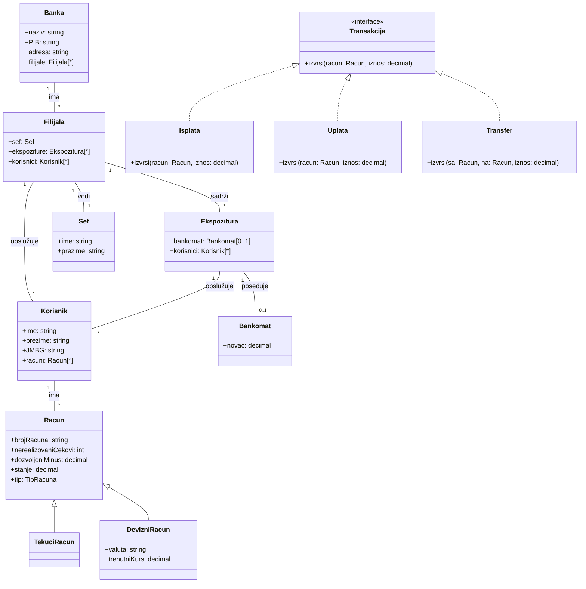

```mermaid
classDiagram
    direction TB

    class Banka {
        +naziv: string
        +PIB: string
        +adresa: string
        +filijale: Filijala[*]
    }

    class Filijala {
        +sef: Sef
        +ekspoziture: Ekspozitura[*]
        +korisnici: Korisnik[*]
    }

    class Ekspozitura {
        +bankomat: Bankomat[0..1]
        +korisnici: Korisnik[*]
    }

    class Korisnik {
        +ime: string
        +prezime: string
        +JMBG: string
        +racuni: Racun[*]
    }

    class Racun {
        +brojRacuna: string
        +nerealizovaniCekovi: int
        +dozvoljeniMinus: decimal
        +stanje: decimal
        +tip: TipRacuna
    }

    class TekuciRacun {
    }

    class DevizniRacun {
        +valuta: string
        +trenutniKurs: decimal
    }

    class Bankomat {
        +novac: decimal
    }

    class Sef {
        +ime: string
        +prezime: string
    }

    class Transakcija {
        <<interface>>
        +izvrsi(racun: Racun, iznos: decimal)
    }

    class Isplata {
        +izvrsi(racun: Racun, iznos: decimal)
    }

    class Uplata {
        +izvrsi(racun: Racun, iznos: decimal)
    }

    class Transfer {
        +izvrsi(sa: Racun, na: Racun, iznos: decimal)
    }

    Banka "1" -- "*" Filijala : ima
    Filijala "1" -- "*" Ekspozitura : sadrži
    Filijala "1" -- "1" Sef : vodi
    Filijala "1" -- "*" Korisnik : opslužuje
    Ekspozitura "1" -- "*" Korisnik : opslužuje
    Ekspozitura "1" -- "0..1" Bankomat : poseduje
    Korisnik "1" -- "*" Racun : ima
    Racun <|-- TekuciRacun
    Racun <|-- DevizniRacun
    Transakcija <|.. Isplata
    Transakcija <|.. Uplata
    Transakcija <|.. Transfer
```
